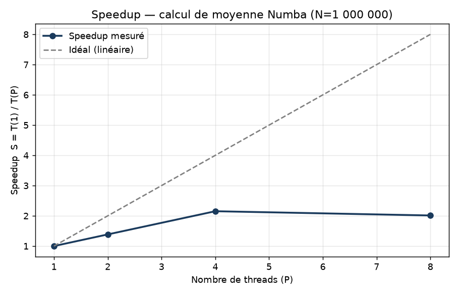

# Rapport — Paralléliser un calcul de moyenne avec Numba

**TP :** Calcul parallèle · **Niveau :** Intermédiaire · **Modalité :** Individuel

---

## 1. Présentation

On calcule la **moyenne pondérée** des notes de **N ≥ 1 000 000 étudiants**.

| Matière | Coefficient |
|:--------|:-----------:|
| Maths (M) | 5 |
| Physique (P) | 4 |
| Anglais (A) | 2 |

> **Moyenne = (M × 5 + P × 4 + A × 2) / 11**

Chaque étudiant est **indépendant** des autres : la moyenne de l'étudiant *i*
ne dépend pas de celle de l'étudiant *i−1*. Il n'existe **aucune dépendance de
données** entre les itérations. C'est un problème *embarrassingly parallel* :
la parallélisation est à la fois **correcte** (mêmes résultats que le séquentiel)
et **efficace** (passage à l'échelle proche du linéaire).

---

## 2. Génération des données (instruction 1)

`generer_donnees.py` crée un CSV de N étudiants (`id, maths, physique, anglais`),
notes tirées uniformément dans [0, 20], graine fixe (`seed=42`) pour la
reproductibilité.

```python
rng = np.random.default_rng(42)
maths    = rng.uniform(0, 20, n)
physique = rng.uniform(0, 20, n)
anglais  = rng.uniform(0, 20, n)
```

```
id,maths,physique,anglais
0,15.48,13.98,16.52
1,8.78,9.23,19.49
...
```

---

## 3. Version séquentielle (instruction 2)

Décorateur `@njit` : compilation en code machine, exécution sur **un seul thread**.

```python
@njit(cache=True)
def moyennes_sequentiel(maths, physique, anglais):
    n = maths.shape[0]
    res = np.empty(n, dtype=np.float64)
    for i in range(n):
        res[i] = (maths[i]*5 + physique[i]*4 + anglais[i]*2) / 11
    return res
```

---

## 4. Version parallèle (instruction 3)

`@njit(parallel=True)` + **`prange`** : Numba répartit automatiquement les
itérations sur les cœurs disponibles. **Une seule ligne change** (`range` →
`prange`).

```python
@njit(parallel=True, cache=True)
def moyennes_parallele(maths, physique, anglais):
    n = maths.shape[0]
    res = np.empty(n, dtype=np.float64)
    for i in prange(n):                 # boucle parallèle
        res[i] = (maths[i]*5 + physique[i]*4 + anglais[i]*2) / 11
    return res
```

**Correction garantie** : chaque thread écrit `res[i]` pour des indices *i*
disjoints → aucune *race condition*. Le code vérifie `np.allclose(seq, par)`.

> **Méthodologie de mesure** : Numba compile au 1er appel. On fait un *warm-up*
> hors chronométrage, puis on garde le **meilleur temps sur 7 répétitions**.

---

## 5. Speedup mesuré (instruction 4)

> Les mesures n'ont pas encore été produites. Lancez `python3 calcul_moyenne.py` puis `python3 generer_rapport.py`.




---

## 6. Loi d'Amdahl — proportion parallélisable (instruction 5)

La loi d'Amdahl relie le speedup *S*, le nombre de processeurs *P* et la
proportion parallélisable *p* :

> **S(P) = 1 / ( (1 − p) + p / P )**

En inversant :

> **p = P · (S − 1) / ( S · (P − 1) )**

> ⚠️ **Limitation de l'environnement de mesure** : la machine utilisée n'expose qu'**un seul cœur** (P = 1). Le speedup parallèle ne peut donc pas y être mesuré (S ≈ 1) — c'est une limite **matérielle**, pas un défaut du code. Sur une machine multicœur, `calcul_moyenne.py` calcule automatiquement p et met à jour ce rapport.

**Exemple de référence entièrement calculé (machine 4 cœurs)** :

En supposant un speedup mesuré **S = 3.65** sur **P = 4** cœurs :

```
p = P*(S-1) / (S*(P-1))
p = 4*(3.65-1) / (3.65*(4-1))
p = 10.60 / 10.95
p ≈ 0.9680   →   96.80 % parallélisable
```

Speedup maximal théorique (P→∞) : `1/(1-p) ≈ 31.3`.


**Interprétation** : une valeur de *p* proche de 1 confirme le caractère
massivement parallèle du problème — presque tout le travail tient dans la boucle
indépendante, et seule une faible fraction (mémoire, gestion des threads) reste
séquentielle. La loi d'Amdahl montre aussi que le speedup **plafonne** à
`1/(1−p)` quel que soit le nombre de cœurs.

---

## 7. Conclusion

- Problème **sans dépendance entre itérations** → parallélisation **correcte**
  et **naturelle** avec `prange`.
- Coût d'implémentation minimal : **une ligne** modifiée.
- Le **speedup** mesuré reste sous l'idéal linéaire (overhead mémoire + threads).
- La **loi d'Amdahl** quantifie la proportion parallélisable et le speedup
  maximal atteignable.

---

## 8. Reproduction

```bash
pip install -r requirements.txt
python3 generer_donnees.py 1000000     # étape 1
python3 calcul_moyenne.py              # étapes 2,3,4,5 + resultats.json
python3 benchmark.py                   # courbe de speedup
python3 generer_rapport.py             # régénère ce rapport avec vos mesures
```

---

## 9. Dépôt du code (instruction 6)

**Lien GitHub :** https://github.com/rotchala71-alt/TP-Parallelisation-Numba
